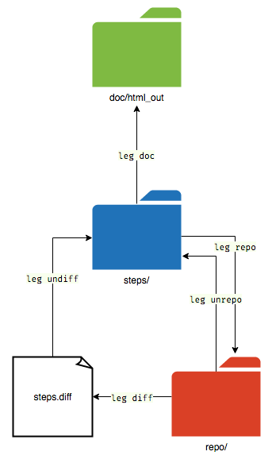

# leg

Command line tool that helps you make step-by-step programming walkthroughs.

## Install

    $ gem install snaptoken

## Usage

`leg` is two things right now: a static site generator, and a converter between
three different file formats for representing a series of diffs. In the future,
the "static site generator" part will probably be replaced with "a library that
can be used to make a plugin for `<insert static site generator of choice
here>`".

`leg` usage is inspired by `git`: You run it inside a "leg working directory",
and you give it the name of a subcommand as the first argument. Run `leg help`
for a short description of each subcommand.

A "leg working directory" is a directory that contains a `leg.yml` file. You
can run `leg` from a subdirectory of that directory, with no change in effects.

`leg.yml` is a YAML file containing a hash of configuration values. These
values are mainly used for the `leg doc` command when rendering a tutorial to
HTML. The main purpose of `leg.yml` is really to mark the directory it's in as
a "leg working directory". The minimal `leg.yml` file just contains the string
`---`.

Abstractly, the type of data that `leg` works with is a 1-indexed array of
steps. Each step has a name (alphanumeric with hyphens), and a tree of files.
`leg` can convert between three different representations of this array of
steps:

* A `steps/` directory that contains a folder for each step. Each step folder
  is named `<step number>-<step name>`, and contains the actual files for that
  step in their entirety.
* A `repo/` directory that contains a simple git repo, where each commit
  represents a step. The commit's commit message stores the step name.
* A `steps.diff` file, which is basically the output of `git format-patch`, but
  with `~~~ step: <step name>` as the header for each commit. This
  representation is a lot more suitable to be put under version control, than
  the other two representations.

Here are the commands that convert between the representations:

* `leg undiff` converts `steps.diff` to `steps/`.
* `leg repo` converts `steps/` to `repo/`.
* `leg unrepo` converts `repo/` to `steps/`.
* `leg diff` converts `repo/` to `steps.diff`.

Here is a diagram that may be helpful:

The `leg doc` command generates a static HTML site out of the Markdown (`*.md`)
files in the `doc/` folder. It uses template HTML files in `doc/html_in/`, and
puts the output files in `doc/html_out/` and `doc/html_offline/`. (The offline
version is meant to include all the font files needed, whereas the normal
version imports fonts from Google Fonts.) `leg doc -z` creates a `.zip` archive
of the offline version.

`leg doc` only uses the `steps/` representation of the steps, not `repo/` or
`steps.diff`.

The `leg doc` command is currently severely coupled to my website and my
specific needs. This'll change. But for now, I suggest using the `doc/html_in/`
folder and `leg.yml` file of the
[kilo-tutorial](https://github.com/snaptoken/kilo-tutorial) repo as a starting
point for a new tutorial.

Each Markdown (`.md`) file in `doc/` will be converted to an HTML file.
`00-index.md` must exist, and will become your `index.html`, and can contain
the string `{{toc}}` which will be replaced with an actual table of contents.

Every occurrence of `` (e.g. `{{example-step}}`) on its own
paragraph in a Markdown file will be replaced with the HTML for that step's
diff.

I'm aware of how unnecessarily complicated everything is. Hopefully sometime
soon I will do a big cleanup of the code. I think I will deemphasize the
`steps/` representation, making the `repo/` representation the main one. And
I'll get rid of the `doc` command, and make it easy to use this gem as a
library to generate your own HTML/whatever output for each diff, or to make a
plugin for a static site generator like Jekyll.

## How to do things

These are notes I made for myself for how to work with the `repo/`
representation of steps, mostly using `git rebase`.

The `leg ref <step-name>` command is a helper that outputs the commit hash of
the commit that has the given step name in its commit message.

### Modify a step

    $ git rebase -i $(leg ref step-name)^
    ... change step-name from 'pick' to 'edit' ...
    $ vim ...
    $ git commit --amend
    $ git rebase --continue

### Modify the first step

    $ git rebase -i --root
    ...

### Insert one or more steps

    $ git rebase -i $(leg ref insertion-point)^
    ... change insertion-point from 'pick' to 'edit' ...
    $ vim ...
    $ git commit
    $ vim ...
    $ git commit
    $ vim ...
    $ git commit
    $ git rebase --continue

### Split a step into multiple steps

    $ git rebase -i $(leg ref step-name)^
    ... change step-name from 'pick' to 'edit' ...
    $ cp file_to_edit.c final.c
    $ git checkout HEAD^ file_to_edit.c
    $ vim file_to_edit.c
    $ git commit --amend
    $ vim file_to_edit.c
    $ git commit
    ...
    $ vim file_to_edit.c
    $ git commit
    $ mv final.c file_to_edit.c
    $ git commit
    $ git rebase --continue

### Combine multiple steps into one

    $ git rebase -i $(leg ref first-step)^
    ... change each step after first-step from 'pick' to 'squash' ...

### Reorder steps

    $ git rebase -i $(leg ref first-step)^
    ... change order of steps in file ...

### Find where a change was introduced

`git blame` or `git bisect`

